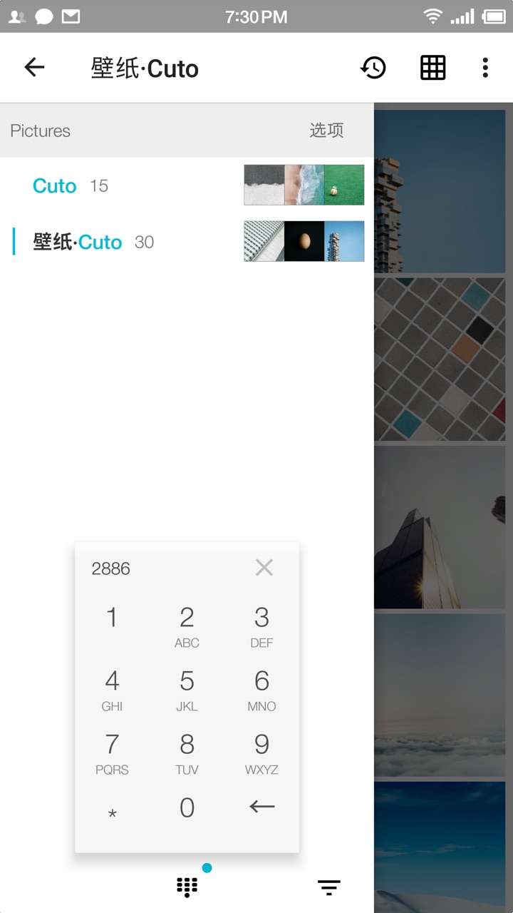

# About 

**PicGo**, an android image viewer app with features:

- **T9 Keypad** : quick T9-Keypad image folder name filtering of image folders from directories `<ExternalStorage>/DCIM` and `<ExternalStorage>/Pictures`.
- **Drag select** : Press image in image list to entering selection mode, drag to select more images.
- **Move file**s : quick move-file-to dialog for moving files to target directory.
- **Image and video** : Supports viewing `gif/jpeg/png/webp` images, and roughly supports viewing video files, likes `."mp4","mov","mpg","mpeg","rmvb","avi"`.
- **Drag close** : drag-down close image viewer page.
- **Share files** : Share image file to third-party applications whose can accecp the image file.

# Download

TBD

Click Releases page of github to download the latest version.

# App Feature Screenshots

Below listing the screen shot of PicGo.

## Feature - T9 Keypad filter

| ヽ｀ヽ、ヽ｀ヽ｀、ヽ｀｀、ヽ、｀｀、 ｀、ヽ｀｀、 、ヽ ｀ ヽ｀、｀、、ヽヽ｀ヽ、｀｀、 、ヽ｀、ヽ｀｀、ヽ｀ヽ｀、、ヽ ｀ヽ｀｀、ヽ｀｀、ヽ｀｀ヽヽ｀ヽ、ヽ｀ヽ｀、ヽ｀｀、ヽ、｀｀、 ｀、ヽ｀｀ | ヽ｀ヽ、ヽ｀ヽ｀、ヽ｀｀、ヽ、｀｀、 ｀、ヽ｀｀、 、ヽ ｀ ヽ｀、｀、、ヽヽ｀ヽ、｀｀、 、ヽ｀、ヽ｀｀、ヽ｀ヽ｀、、ヽ ｀ヽ｀｀、ヽ｀｀、ヽ｀｀ヽヽ｀ヽ、ヽ｀ヽ｀、ヽ｀｀、ヽ、｀｀、 ｀、ヽ｀｀ |
| ------------------------------------------------------------ | ------------------------------------------------------------ |
| input "2886" for "Cuto"                                      |  |
| input "733" for "Reddit"                                     |  |
| input "93" for "文"                                          |  |

## Feature - Image File Name Conflict Dectection

| ヽ｀ヽ、ヽ｀ヽ｀、ヽ｀｀、ヽ、｀｀、 ｀、ヽ｀｀、 、ヽ ｀ ヽ｀、｀、、ヽヽ｀ヽ、｀｀、 、ヽ｀、ヽ｀｀、ヽ｀ヽ｀、、ヽ ｀ヽ｀｀、ヽ｀｀、ヽ｀｀ヽヽ｀ヽ、ヽ｀ヽ｀、ヽ｀｀、ヽ、｀｀、 ｀、ヽ｀｀ | ヽ｀ヽ、ヽ｀ヽ｀、ヽ｀｀、ヽ、｀｀、 ｀、ヽ｀｀、 、ヽ ｀ ヽ｀、｀、、ヽヽ｀ヽ、｀｀、 、ヽ｀、ヽ｀｀、ヽ｀ヽ｀、、ヽ ｀ヽ｀｀、ヽ｀｀、ヽ｀｀ヽヽ｀ヽ、ヽ｀ヽ｀、ヽ｀｀、ヽ、｀｀、 ｀、ヽ｀｀ |
| ------------------------------------------------------------ | ------------------------------------------------------------ |
| Name conflict detection                                      |  |

## Feature - Image Viewer

| ヽ｀ヽ、ヽ｀ヽ｀、ヽ｀｀、ヽ、｀｀、 ｀、ヽ｀｀、 、ヽ ｀ ヽ｀、｀、、ヽヽ｀ヽ、｀｀、 、ヽ｀、ヽ｀｀、ヽ｀ヽ｀、、ヽ ｀ヽ｀｀、ヽ｀｀、ヽ｀｀ヽヽ｀ヽ、ヽ｀ヽ｀、ヽ｀｀、ヽ、｀｀、 ｀、ヽ｀｀ | ヽ｀ヽ、ヽ｀ヽ｀、ヽ｀｀、ヽ、｀｀、 ｀、ヽ｀｀、 、ヽ ｀ ヽ｀、｀、、ヽヽ｀ヽ、｀｀、 、ヽ｀、ヽ｀｀、ヽ｀ヽ｀、、ヽ ｀ヽ｀｀、ヽ｀｀、ヽ｀｀ヽヽ｀ヽ、ヽ｀ヽ｀、ヽ｀｀、ヽ、｀｀、 ｀、ヽ｀｀ |
| ------------------------------------------------------------ | ------------------------------------------------------------ |
| Image viewer                                      |  |
| Image Information                                    |  |
| Drag-down-close                                          |  |

## Feature - Quick Move To

| ヽ｀ヽ、ヽ｀ヽ｀、ヽ｀｀、ヽ、｀｀、 ｀、ヽ｀｀、 、ヽ ｀ ヽ｀、｀、、ヽヽ｀ヽ、｀｀、 、ヽ｀、ヽ｀｀、ヽ｀ヽ｀、、ヽ ｀ヽ｀｀、ヽ｀｀、ヽ｀｀ヽヽ｀ヽ、ヽ｀ヽ｀、ヽ｀｀、ヽ、｀｀、 ｀、ヽ｀｀ | ヽ｀ヽ、ヽ｀ヽ｀、ヽ｀｀、ヽ、｀｀、 ｀、ヽ｀｀、 、ヽ ｀ ヽ｀、｀、、ヽヽ｀ヽ、｀｀、 、ヽ｀、ヽ｀｀、ヽ｀ヽ｀、、ヽ ｀ヽ｀｀、ヽ｀｀、ヽ｀｀ヽヽ｀ヽ、ヽ｀ヽ｀、ヽ｀｀、ヽ、｀｀、 ｀、ヽ｀｀ |
| ------------------------------------------------------------ | ------------------------------------------------------------ |
| Move image file                                      |  |

## Feature - MISC

| ヽ｀ヽ、ヽ｀ヽ｀、ヽ｀｀、ヽ、｀｀、 ｀、ヽ｀｀、 、ヽ ｀ ヽ｀、｀、、ヽヽ｀ヽ、｀｀、 、ヽ｀、ヽ｀｀、ヽ｀ヽ｀、、ヽ ｀ヽ｀｀、ヽ｀｀、ヽ｀｀ヽヽ｀ヽ、ヽ｀ヽ｀、ヽ｀｀、ヽ、｀｀、 ｀、ヽ｀｀ | ヽ｀ヽ、ヽ｀ヽ｀、ヽ｀｀、ヽ、｀｀、 ｀、ヽ｀｀、 、ヽ ｀ ヽ｀、｀、、ヽヽ｀ヽ、｀｀、 、ヽ｀、ヽ｀｀、ヽ｀ヽ｀、、ヽ ｀ヽ｀｀、ヽ｀｀、ヽ｀｀ヽヽ｀ヽ、ヽ｀ヽ｀、ヽ｀｀、ヽ、｀｀、 ｀、ヽ｀｀ |
| ------------------------------------------------------------ | ------------------------------------------------------------ |
| Open Recents                                     |  |
| View Mode                                    |  |
| Setting                                          |  |
| Folder excluding setting                                          |  |

# License

Apache license 2.0